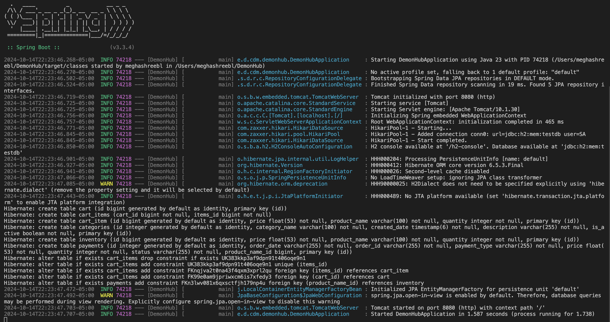

## Purpose
DemonHub is an exclusive e-commerce platform designed for the DePaul University community. Offering a curated selection of products tailored to students, faculty, and alumni, this one-stop shop provides everything from textbooks and tech to DePaul-branded gear and essentials. Accessible only to DePaul members, it's your trusted source for quality items that fit your unique university lifestyle. Safe, convenient, and just for Blue Demons!
 
* Milestone 1: Our Project Prototype: [DemonHub](https://app.moqups.com/v14bDpifAPFutAIOjrU583kqOtG84MWQ/view/page/a4e233e3d?ui=0)
* Milestone 2: Define our database strcuture and coding standards. 

## Project Members

| Member | Area  |
| ----------- | ----------- |
| Serhat Cingilli | Product / Inventory Management |
| Manoj Puttaswamy | Categories  |
| Manoj Puttaswamy | User | 
| Meghashree Badri Lakshmi Narasimhan | Order |
| Mahadev Reddy Kasireddy | Cart
| Ibrahim Ibrahim | Reviews
 

## Conflict Resolution
**Dot voting**: Each team member gets a set number of "dots" (or points) to allocate to their preferred options. This allows the group to prioritize solutions or approaches collectively. 

 

## Communication Mechanism
We use Discord as our communication mechanism. Our meetings are planned for Fridays once a week.

 

## Working code screenshot

## Decision Made
| # | Area  | Decision | Alternative | Rationale
| ----------- | ----------- | --- | --- |--- |
| 1 | IDE | Use VS Code |IntelliJ, Eclipse | Great extentions available, most members have extentions and settings set up for their efficiency.
| 2 | Dependency Management  | Maven | Gradle | Our team had the most experience with Maven, and worked with it before
| 3 | Code  | Lombok | Code template code | Great oppurtunity to speed up our Java coding process, very integrated with Maven.
| 4 | Configuration Management  | JSON | Properties | Easier to view groups of configuration and is easier to read and understand, most people have experience working with JSON.
| 5 | Backend  | Spring Boot | NodeJs | It simplifies backend development with minimal configuration, built-in features for rapid development, and strong support for microservices and production-ready capabilities.
| 6 | Dependencies used | mysql-connector-java | MariaDB | MySQL Connector/J (also known as mysql-connector-java) is a Java-based driver that lets Java applications communicate with MySQL databases. Think of it as a bridge that helps your Java code talk to a MySQL database to store, retrieve, and manage data.

